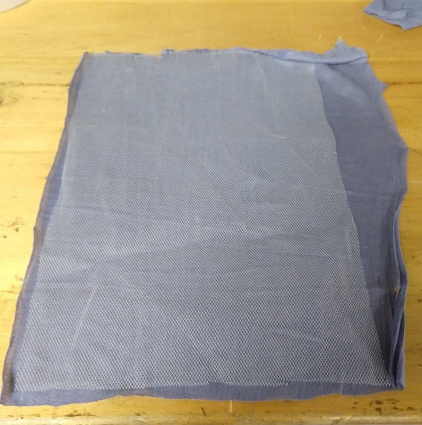

# DIY Simple Medical (like) Facemasks

**UPDATE** Read this [cloth mask study][mask_study].  Lots of caveats with cloth masks.  

* Fact: Cloth masks should not replace PPE (N95) masks for airborne viruses.  Only proper PPE with **handwash** is effective!

* **Un-validated** improvements for cloth masks:
   * Please add a non wicking layer between the inner and out mask. Examples: netting, tulle etc. There needs to be a moisture barrier.
   * Wearers: Replace cloth masks often! and **wash hands after taking it off.**

* **N95** mask cover: If you double the length of the mask (aka 22in x 8.5). This mask will fit over an N95 mask.

This produces a very simple and fast to make cloth mask.  Adjust size as needed.

If you are a good seamtress and have supplies please take a look at [my favorite][favorite_DIY].  It looks awesome!  Also if you are more cautious you can use the [CDC Mask instructions][CDC_mask].  There is also one designed by a [Nurse][Nurse_mask].

For the rest of us with random supplies and lower skills, then this page is for you.

## Instructions:

### Materials:
* **ONE** 11 my 8.5 inch piece of cloth. (Either Linen or Cotton)
* 1-2 ~ 4in long 24 guage wire, paper clip, If for personal use bag ties or pipe cleaner
* 1/4 inch ribbon, material or elastic
* (Optional) 1 1/2 ribbon or quilt/blanket edging material.
* Thread: any color

### Steps
-   [Cut the Cloth](#cut-the-cloth)
-   [(Mandatory) Moisture Spacer / Wicking
    Barrier or pocket](#mandatory-moisture-spacer-wicking-barrier)
-   [ADD: Bag tie pocket](#add-bag-tie-pocket)
-   [Fold Fabric in behalf](#fold-fabric-in-behalf)
-   [Fold Fabric like a
    cummberbund](#fold-fabric-like-a-cummberbund)
-   [Sew the side edges
    together](#sew-the-side-edges-together)
-   [(OPTIONAL) Sew Bottom](#optional-sew-bottom)
-   [Add Ties or Elastic](#add-ties-or-elastic)
-   [Done](#done)

#### Cut the Cloth
Use a sheet of paper for your template.  Cut a single pieces of cloth the size of a sheet of paper.
You do not have to be exact, simply within the ballpark.  Make larger or smaller for your head.

From here our I will refer to this a the *square*.

| GOOD Cut  | BAD Cut |
|:---:|:---:|
|||

**NOTE** The outer cloth should be cotton or linen to absorb moisture!

#### (Mandatory) Moisture Spacer / Wicking Barrier

* A moisture wicking barrier.  Here I added another *middle* layer using netting or tulle.
    

OR Add a pocket so that the person using it can put there own filter layer

NOTE: See [mask study][mask_study] for more information.  Also change frequently and wash hands after taking a cloth mask off.

#### ADD: Bag tie pocket
On ONE of the short edges of the *square* we will add a pocket for the bag tie.
The bag tie will allow us to mold the mask to our nose.  I used a ribbon to make a pocket for the bag tie

**NOTE** Some places do not want ANY plastic bag tie since the plastic melts when it is sterilized and the same is true with pipe cleaners.  Both of these are fine if the uses is just washing and drying it in a normal home laundry equipment.

*DO add the pocket*, it will allow the user to use what they feel comfortable.

If you have 24 like gauge wire please use that.   

| Square with Tie before sewing | Square with tie after sewing |
|:-----: |:---:|
| ||

#### Fold Fabric in half
Folder the fabric (while in portrait mode) in half.  You want the **WIDTH** to be 8.5 inches across.  You also want the *right* (nice) side of the fabric facing **out**.

#### Fold Fabric like a cummerbund / paper fan
Fold like a cummerbund for paper fan.  
I am finding that the shorter the length the sides are the better the fit.
Have the cummerbund creases *pointing to the bottom*.  

Another view.

#### Sew the side edges together
Sew both sides and trim edges
(Optional) Zig-zag stitch here is nice to use.

#### (OPTIONAL) Sew Bottom
For a cleaner looking edge, you can sew the bottom end.

#### Add Ties or Elastic
What you do here depends on the material you have.  

**NOTE** You may want to add a pocket at the top so that users can add additional filters.

##### If you have ribbon or cloth edges.
Sew the the ties onto the mask see image below.

##### If you have ribbon Elastic holder and 1 1/2" ribbon
Fold the ribbon in half and sew it onto each ends of the mask.  This makes a slot for the ribbon or elastic to attach to the mask.
Note a crochet hook makes threading the ribbon or elastic easier.

#### Done
**Note:** the slot for the bag tie is to make a good fit around the nose.

## NOTICE / WARNING
I make NO CLAIMS that these masks will protect you from covid19. Use at your own risk.  These are not Medical Mask.  

### Beware of Cats
Cats will hinder your progress!  But they are too cute to move.

## Resources
[deaconess]:https://www.deaconess.com/How-to-make-a-Face-Mask
[favorite_DIY]:https://www.instructables.com/id/DIY-Cloth-Face-Mask/
[CDC_mask]:https://wwwnc.cdc.gov/eid/article/12/6/05-1468_article
[Nurse_mask]:https://www.instructables.com/id/AB-Mask-for-a-Nurse-by-a-Nurse/
[mask_study]:https://bmjopen.bmj.com/content/bmjopen/5/4/e006577.full.pdf

* [basic mask][deaconess]
* [favorite mask][favorite_DIY]
* [CDC mask][CDC_mask]
* [Nurse Designed][Nurse_mask]
* [Cloth Mask Study][mask_study]
