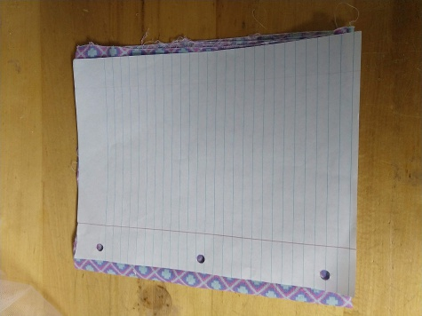

# DIY Simple Medical (like) Facemasks

If you are a good seamtress and have supplies please take a look at [my favorate][favorite_DIY].  It looks awesome!  Also if you are more cautious you can use the [CDC Mask instructions][CDC_mask].

For the rest of us with random supplies, a low skill this page is for you.

## Instructions:

### Materials:
* Two 11 my 8.5 inch piece of cloth. (one piece should be either Linen or Cotton)
* 1-2 bag ties
* 1/4 inch ribbon or elastic
* 1 1/2 ribbon or quilt/blanket edging material.
* Thread: any color

### Cut the cloth
Use a sheet of paper for your template.  Cut two pieces of cloth the size of a sheet of paper.

**NOTE** The outer cloth should be cotton or linen to absorb moisture!

### (Optional) Moisture Spacer
I wanted my mask to have the following (unproven) features:
* A moisture wicking barrier.  Here I used netting.
  
* Have two types of material with different tribostatics: e.g. take or give an elections.  My (UNPROVEN) theory is that when the air moves across the two barriers it would self ionize.  Again it is UNPROVEN.

### Sew Edge
Fold over the **A** single short side of the cloth and sew the edge down.  We are going to call this the top side

We want a clean edge to make a pocket for adding additional filters.

### ADD: Bag tie pocket
One ONE of the folded sewn edges we will add a pocket for the bag tie.
The bag tie will allow us to mold the mask to our nose.  I used a ribbon to make a pocket for the bag tie

### (OPTIONAL)
At this point, you can fold the mask like a cummerbund and iron to make nice creases.

This will make life easier, but I dislike ironing.

### Sew the two pieces together
Align the two sewn edges, with the **nice** side of the fabric facing each other.  

Then sew the two pieces together at the other short end.

### Flip right side out
Flip the fabric, right side out and sew the two sides.

### (OPTIONAL) Sew Bottom
For a cleaner looking edge, you can sew dew the bottom end.

### Sew the top side
We are going to sew the top of the mask **but** leave room for adding additional filters and bag tie

### Add Ribbon / Elastic holder
Fold the ribbon in half and sew it onto each ends of the mask.  This makes a slot for the ribbon or elastic to attach to the mask.

### Add Elastic or ribbon
Add elastic or ribbon for ear loops of head ties

## NOTICE / WARNING
I make NO CLAIMS that these masks will protect you from covid19. Use at your own risk.  These are not Medical Mask.  

### Beware of Cats
Cats will hinder your progress!  But they are too cute to move.

## Resources
[deaconess]:https://www.deaconess.com/How-to-make-a-Face-Mask
[favorite_DIY]:https://www.instructables.com/id/DIY-Cloth-Face-Mask/
[CDC_mask]:https://wwwnc.cdc.gov/eid/article/12/6/05-1468_article

* [basic mask][deaconess]
* [favorite mask][favorite_DIY]
* [CDC mask][CDC_mask]
