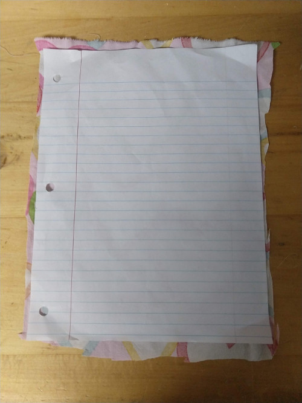

# DIY Scrub Cap for PRUSA RC2 FaceShield: V 1.2

**UPDATE** Added Sizing!

[PRUSA][prUSA_RC2] has a wonderful open source faceshield.
Unfortunately, 3D printed parts can be hard on the skin and finding Elastic
is currently hard to find.  

Solution, skull cap that attaches to the RC2 fa ceshield.  This pattern is based on [an instructable skull cap][original_cap].

## Features:
* Ability to flip up the faceshield
* Attach and adjust tension
* Distrbute weight of shield across head
* Cushion between mask and skin

| FaceShield Down | FaceShield Up |
| :---:            | :---: |
|| |

## Instructions:

### Materials:
* Band: ~5 1/5 by 28 inch piece of cloth. (Either Linen or Cotton)
* Strap: 42 inch long bias tape ~ 2 wide unfolded. clip
* Top: 9 by 6.5 inch wide
* 2 straps 4 inches long by 1/2-1/4 inch wide.
* Thread: any color
* US Quarter for strap spacing measurement.

### Steps
-   [Cut the Cloth](#cut-the-cloth)
-   [(Optional) Iron the bias
    tape](#optional-iron-the-bias-tape)
-   [Sew the band and top
    together](#sew-the-band-and-top-together)
-   [Sew Halfway down the band](#sew-halfway-down-the-band)
-   [Cut Each side of the bottom band in half, then sew the
    edges](#cut-each-side-of-the-bottom-band-in-half-then-sew-the-edges)
-   [Add Strap to hold faceshield
    on](#add-strap-to-hold-faceshield-on)
-   [You are done!](#you-are-done)

#### Cut the Cloth
Cut the band, strap and top pieces of cloth.
For the top piece round the corners but leave the bottom flat.

You do not have to be exact, simply within the ballpark.  Make larger or smaller for your head.

|

| GOOD Cut  | BAD Cut |
|:---:|:---:|
|||

#### (Optional) Iron the bias tape
Fold the bias tape in 1/2 and then fold inwards the tape so that it is about 1/2" wide.  Your life will be much easier if you iron it flat.

#### Sew the band and top together
Starting in the middle of the flat part of the top piece, sew the band and top piesce together.  Have the *nice/right* side facing together. Leave about 1/4 inch of the band

#### Sew Halfway down the band
Sew halfway down the band

#### Cut Each side of the bottom band in half, then sew the edges
Cut each side of the band at a 45 degree angle.  Then fold over the freshly cut edges and sew them down.

| Cap Band | |
|:--: | :--:|
| | |

**BONUS:** This makes a pony tail holder!

#### Sew the Bias Tape on
Find the middle of the bias tape and the skull cap and pin it together.  Then slid the tape against the fabric till you come to the end.  Then pin it to the cap's band.  At one end of the bias tap, start sewing the bias tape together.

#### Add Strap to hold faceshield on
Fold the cap in half, measure 5" from the top end.  Sew the strap perpendicular to the bias tape. There should be about 1 1/4 gap between the top and bottom of the strap.  Or use a US Quarter to measure the spacing for the gap.

| Strap Gap Size | Strap |
|:--: |:---:|
|| |

| Strap Sewn  | Strap Attached to Shield|
|:--:|:--:|
| | |

#### You are done!
| 

## NOTICE / WARNING
I make NO CLAIMS that these masks will protect you from covid19. Use at your own risk.  These are not Medical Mask.  

### Beware of Cats
Cats will hinder your progress!  But they are too cute to move.

## Resources
[original_cap]:https://www.instructables.com/id/DIY-SurgicalScrub-Hat/
[prUSA_RC2]:https://www.prusaprinters.org/prints/25857-prusa-protective-face-shield-rc2
[CDC_mask]:https://wwwnc.cdc.gov/eid/article/12/6/05-1468_article
[Nurse_mask]:https://www.instructables.com/id/AB-Mask-for-a-Nurse-by-a-Nurse/
[mask_study]:https://bmjopen.bmj.com/content/bmjopen/5/4/e006577.full.pdf

* [Original Cap][original_cap]
* [prUSA RCS mask][prUSA_RC2]
* [CDC mask][CDC_mask]
* [Cloth Mask Study][mask_study]
